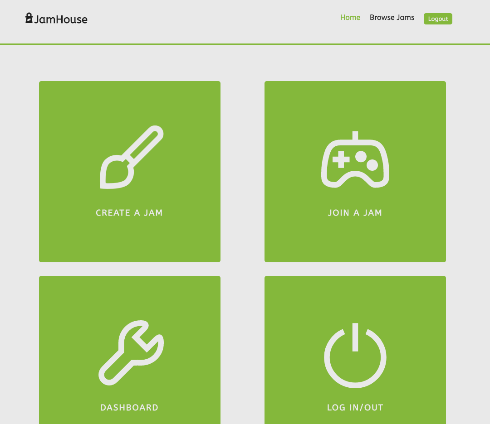
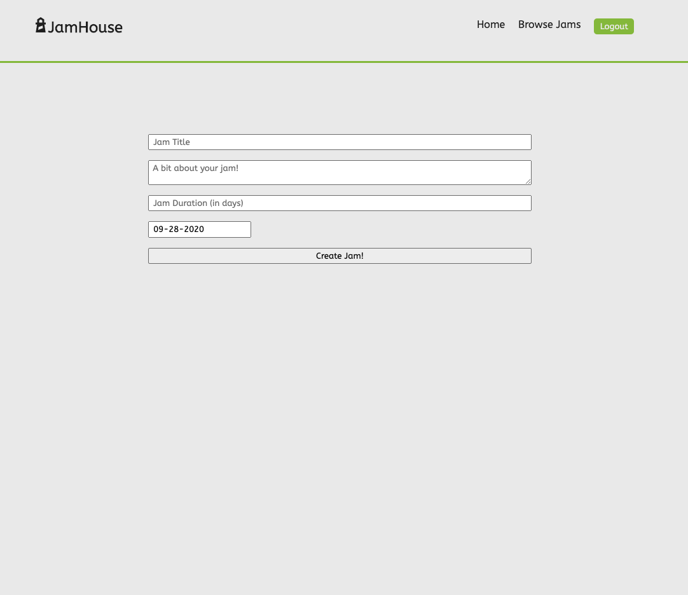

# JamHouse

JamHouse is an application where game creators can connect, create game jams, and join game jams! No matter the platform, tech stack, or game engine, JamHouse let's users network and share projects and ideas with other game creators.

Check out the deployed application: [Click here](https://secure-falls-93003.herokuapp.com/)

## Project Proposal

Interested in the behind the scenes? [Click here](./setup/proposal.md) to check out this project's proposal.

## Wireframes

[Here you can find wireframes](./setup/wireframes) that were used to lay out the intial design and flow of the project.

## Project Board

[Here you can find the project board used to track this project!](https://github.com/johncoryk/jam-house/projects/1)

## Built With

- React
- Express
- PostgreSQL
- React-Icons
- React Date Picker
- React-Modal
- Deployed to Heroku

## Future Improvements

Though I'm happy with how the application looks and feels, there are a few goals I did not reach and a few things I'd love to implement down the road. A ranking system based off of creator feedback in regards to other creator's games would really take the application to another level and create a more exciting experience. I would also like to implement a way to embed HTML5 games right in the browser.
